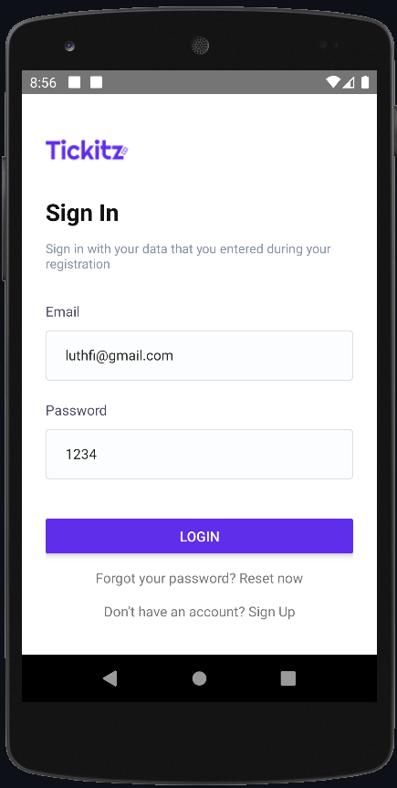
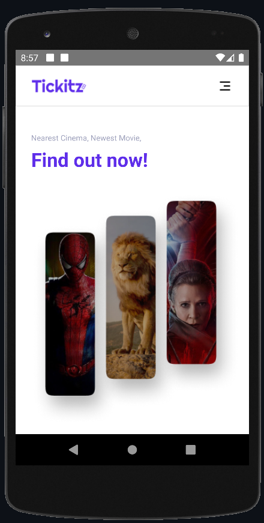
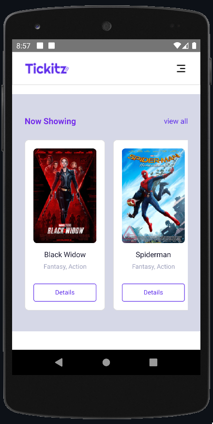

<h1 align="center">Tickie Mobile</h1>
<h4 align="center">Tickie is a website-based application that can help users in getting the latest fillm information and making online bookings and payment.</h4>

<hr>
<br>
#background_projek. [More about React Native](https://en.wikipedia.org/wiki/Express.js)

## Built With

- [React Native] - UI Library for cross platform
- etc.

## How to run the app ?

- npm install
- npx react-native link
- npx react-native run-android

## Set up .env file

Open .env file on your favorite code editor, and copy paste this code below :

```
REACT_APP_URL_BE=localhost
REACT_APP_URL_CLOUDINARY=cloudinary
```

## Demo

<div display="flex">



</div>

## License

© [Luthfi Thufail Asiddiqi](https://github.com/luthfidiqi/)
